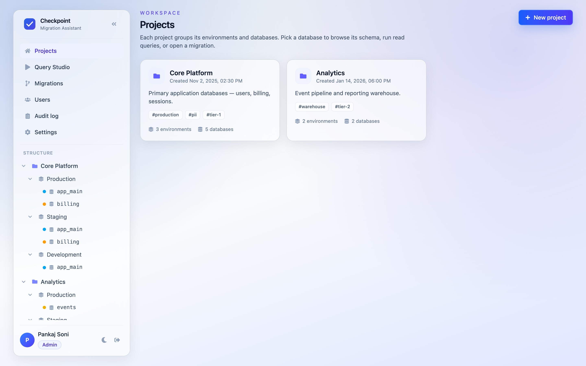
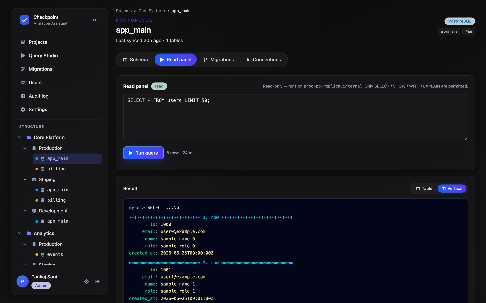

# Checkpoint

A database migration assistant. Propose schema changes as reviewable migrations,
get them approved, apply them through a controlled write connection, and keep a
full audit trail. Browse live schema and run read-only queries against your
databases — all behind Google sign-in with role-based access.

> **Status:** The **frontend is complete** and runs entirely against in-memory
> mock data. The **backend is stubbed** — see [`server/index.ts`](server/index.ts)
> and the `USE_MOCKS` flag in [`src/services/api.ts`](src/services/api.ts). The
> API contract the backend must implement is documented in
> [`docs/features.md`](docs/features.md).

## Screenshots

| Projects | Migration review |
| --- | --- |
|  |  |

| Schema browser | Query Studio (read panel) |
| --- | --- |
|  |  |

## Stack

- **Frontend:** React 19, TypeScript, Tailwind CSS v4, React Router 7, Vite
- **Notifications:** react-hot-toast (custom-themed)
- **Backend:** Bun + (planned) Express-style HTTP, sessions, OAuth — currently stubbed
- **Deployment:** Docker (multi-stage) + docker-compose

## Core concepts

```
Project ─┬─ Environment (production / staging / development) ─┬─ Database
         │                                                    │   ├─ read connection   (schema pulls, read panel)
         │                                                    │   └─ write connection  (apply migrations)
```

A **migration** targets one database, carries one or more ordered SQL statements,
and moves through a lifecycle: `draft → pending_approval → approved → applied`
(or `rejected` / `failed`). Reviewers and threaded comments support the review.

## Features

1. **Google login** with role-based access (`admin` / `editor` / `viewer`).
2. **Structure tree** — Project → Environment → Database in a collapsible sidebar.
3. **Multi-engine** — PostgreSQL, MySQL, ClickHouse.
4. **Schema browser** — tables, columns, types, indexes, row estimates.
5. **Pull schema** — sync current structure from the database (read connection).
6. **Query Studio / read panel** — SELECT-only queries; results as a table or
   MySQL `\G`-style vertical view.
7. **Migrations** — multi-statement, create → submit → approve → apply, with
   reviewers, comments, and a per-migration audit trail.
8. **Read & write connections** per database.
9. **User management** — invite users, assign roles.
10. **Audit log** — system-wide, filterable record of actions.
11. **Settings** — email (SMTP) + Slack notification configuration (tabbed).
12. **UX** — dark mode, responsive mobile drawer, breadcrumbs, toasts.

See [`docs/features.md`](docs/features.md) for the full feature + data-model +
API specification used to plan the backend.

## Roles

| Capability                          | viewer | editor | admin |
| ----------------------------------- | :----: | :----: | :---: |
| Browse schema, run read queries     |   ✓    |   ✓    |   ✓   |
| Pull schema, create/submit migration|        |   ✓    |   ✓   |
| Add reviewers, comment              |        |   ✓    |   ✓   |
| Approve / reject / apply migration  |        |        |   ✓   |
| Manage users, write connections, settings |  |        |   ✓   |

## Develop

```bash
bun install
bun run dev          # client (:3000) + stub server (:3001)
bun run typecheck
bun run build
bun run lint
```

The mock API has a built-in admin session — click **Continue with Google** on
the login screen to enter. Flip `USE_MOCKS` to `false` in
[`src/services/api.ts`](src/services/api.ts) once the real backend is up; every
`api.*` method already has the matching real route wired behind that flag.

## Deploy

```bash
cp .env.example .env   # fill in Google OAuth + metadata DB
docker compose -f docker-compose.example.yml up --build
```

## Project layout

```
src/
  types.ts              domain model (the API contract in TS)
  services/
    api.ts              client; USE_MOCKS toggles mock vs. real fetch
    mockData.ts         in-memory seed data
  context/              AuthContext, ThemeContext
  lib/                  format helpers, toast
  components/           Layout, StructureTree, Dropdown, ui primitives, …
  pages/                one file per screen
server/index.ts         stub Bun server (serves SPA, /api → 501)
docs/features.md        feature + data model + API spec for the backend
```

## Related docs

- [`AGENTS.md`](AGENTS.md) — conventions for AI agents / contributors.
- [`docs/features.md`](docs/features.md) — backend planning spec.
